# Next K 项目架构与代码流程学习指南

> 本文按当前 `release` 分支代码编写。它不是简单的文件清单，而是从进程启动、
> 定时扫描、策略决策、数据库落盘、实盘下单到前端展示，完整解释数据如何流动。

## 1. 先建立整体心智模型

Next K 不是一个单体应用，而是三个独立部署、独立 Git 仓库组成的系统：

| 子项目 | 默认端口 | 核心职责 | 不负责什么 |
|---|---:|---|---|
| `next-k-api` | 8000 | 拉行情、算指标、生成信号、ORB 纸面交易、OI 雷达、归档数据 | 不直接保存币安密钥，不直接向币安下单 |
| `Next-k-protocol` | 8001 | 接收标准化交易动作、幂等去重、调用币安、创建保护单、查询实时持仓 | 不判断策略好坏，不重新计算仓位和止损 |
| `next-k-frontend` | 静态站点 | 调用两个后端并渲染仪表盘、维护面板和币安账户页 | 不保存业务数据，不参与策略决策 |

最重要的边界是：

```text
策略决定“要不要交易、交易多少、止损在哪里”
                        ↓
next-k-api 生成完整交易意图
                        ↓
Protocol 只负责“可靠且安全地执行这个意图”
```

### 1.1 系统总流程图

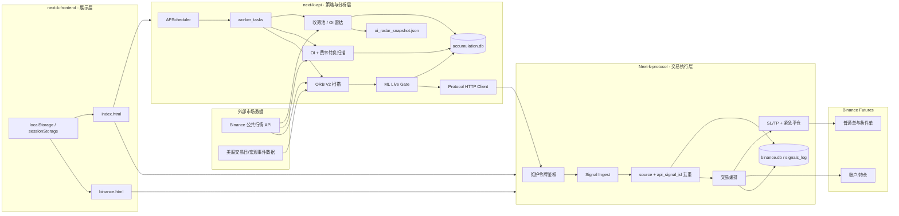

## 2. 进程和部署模型

### 2.1 API 服务启动

入口是 `next-k-api/main.py`。

启动顺序：

1. `env_loader.load_env_oi()` 加载 API 目录下的 `.env.oi`。
2. 创建 FastAPI 应用和 CORS 中间件。
3. lifespan 启动阶段记录启动时间。
4. 根据 `NEXT_K_EMBED_SCHEDULER` 决定是否在 API 进程内启动 APScheduler。
5. 初始化 `accumulation.db` 的所有业务表。
6. 检查 ORB 生产模型路径和环境变量风险。
7. 确保 `orb_live/` 运行模型包存在。
8. 注册所有路由。
9. lifespan 退出阶段关闭内嵌调度器。

API 支持两种运行方式：

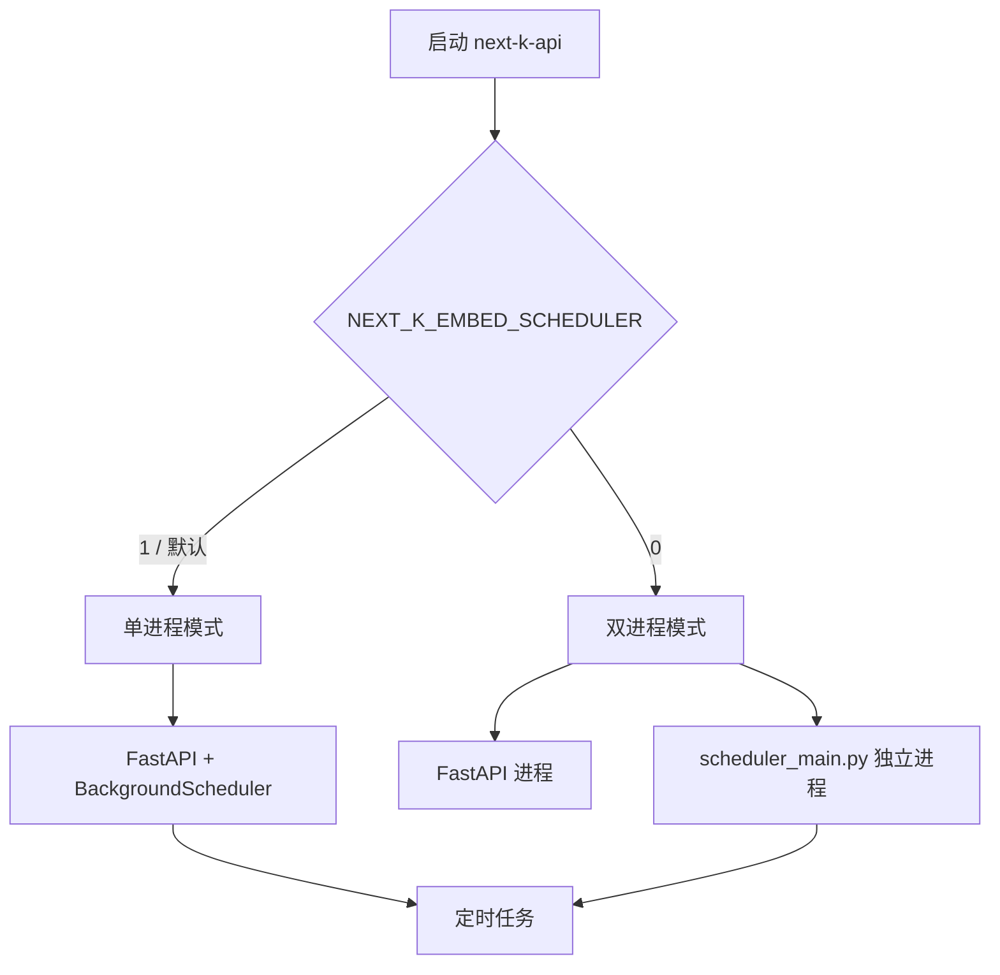

为什么支持双进程：

- Web 服务和长扫描可以独立重启。
- 防止多 worker 部署时每个 worker 都启动一套定时任务。
- 调度器崩溃不会直接拖垮 HTTP API。

### 2.2 Protocol 服务启动

入口是 `Next-k-protocol/main.py`。

启动阶段只做两件关键事情：

1. 初始化 `binance.db`。
2. 构造全局 `BinanceClient`，但 key、secret、主网/测试网地址通过闭包读取环境变量。

这样做的好处：

- 密钥不进入 SQLite。
- Binance HTTP 层不依赖业务数据库，容易单测。
- 测试可以替换 URL 和密钥读取函数。

## 3. API 定时任务系统

### 3.1 调度表

任务注册位于 `scheduler_config.register_scheduled_jobs()`。

| 任务 ID | 时间 | 执行函数 | 用途 |
|---|---|---|---|
| `pool_daily` | 每日 10:00（上海时区） | `run_pool_task` | 重建收筹池 |
| `heat_watch_refresh` | 每小时 xx:07 | `run_heat_watch_refresh_task` | 刷新热度看盘 |
| `oi_hourly` | 每小时 xx:30 | `run_oi_task` | OI 雷达 |
| `s2_oi_funding` | 每小时 xx:05 | `run_s2_oi_funding_task` | 费率转负强信号 |
| `orb_scanner` | 默认每 5 分钟并对齐 UTC K 线 | `run_orb_scan_task` | ORB 扫描和持仓结算 |
| `orb_v2_monthly_train` | 每月 1 日 03:00，可选 | `run_orb_v2_monthly_train_task` | 月度模型训练 |
| `orb_ml_kline_refresh` | 每月 1 日 02:00，可选 | `run_orb_ml_kline_refresh_task` | 刷新训练 K 线 |

### 3.2 为什么任务多数使用子进程

`worker_tasks.py` 没有直接在调度线程里执行大型扫描，而是启动：

- `accumulation_radar.py`
- `s2_oi_funding_rate_scanner.py`
- `orb_scanner.py`

每类任务还有独立的 `threading.Lock`。

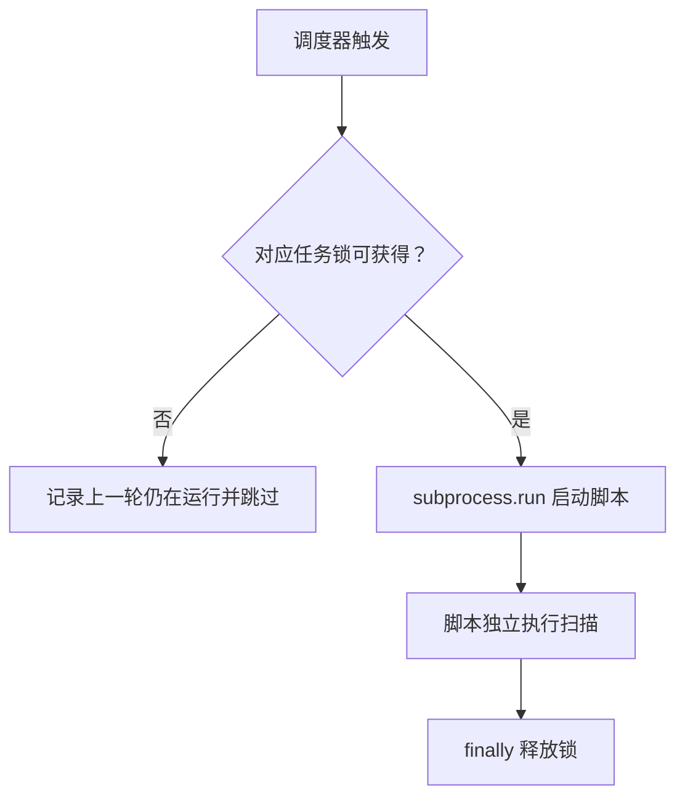

这解决两个问题：

- 上一轮超过调度周期时不会重叠扫描和重复写库。
- 大任务中的内存、网络连接和异常与 API 主进程隔离。

## 4. 收筹池与 OI 雷达

主要文件是 `accumulation_radar.py`，它同时承担：

- SQLite 建表和迁移。
- Binance 公共接口请求。
- 收筹特征计算。
- OI 多时间段变化计算。
- 市值、成交量、BPC 等辅助指标。
- 多种关注榜单生成和归档。
- JSON 快照生成。
- Telegram 报告。

### 4.1 每日收筹池

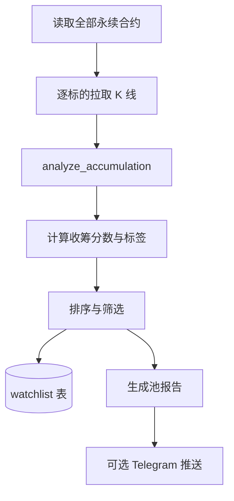

### 4.2 每小时 OI 雷达

`run_oi_hourly_radar()` 是雷达总编排函数。

概念流程：

1. 从收筹池和全市场获取扫描对象。
2. 拉取 OI 历史、价格、资金费率和市场信息。
3. 计算多个时间窗口的 OI 变化。
4. 根据规则生成 heat、ambush、focus、patrick、worth 等榜单。
5. 写入对应 SQLite 表并执行保留期清理。
6. 写 `oi_radar_snapshot.json`。
7. 定时任务模式下发送 Telegram；前端手动刷新模式不发送。

前端 GET 接口只读磁盘快照，不现场执行 1–2 分钟的扫描，因此响应很快。

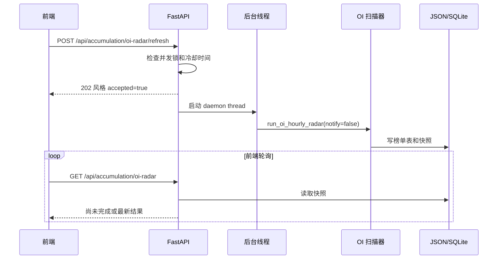

## 5. S2 费率转负信号

`s2_oi_funding_rate_scanner.py` 关注的是资金费率从非负转负，同时 OI 抬升的组合。

核心思想：

- 负费率表示空头支付多头。
- OI 上升表示新仓位进入。
- 两者同时发生，可能形成拥挤空头和潜在挤压条件。

结果写入 `accumulation.db.s2_funding_signals`，API 默认只返回近两日记录。

## 6. ORB 策略概念

ORB = Opening Range Breakout，开盘区间突破。

当前默认美股权益永续配置：

- 交易时区：`America/New_York`
- 开盘：09:30
- 收盘：16:00，支持提前收盘日
- Opening Range：开盘后 15 分钟
- 信号 K 线：5 分钟
- 入场：收盘价确认突破 OR 高点或低点
- 止损：默认日线 ATR 的 5%
- 出场：默认收盘退出
- 仓位：按单机器人本金和风险百分比计算

### 6.1 Opening Range

`compute_opening_range()`：

```text
OR High = 开盘区间内所有 K 线 high 的最大值
OR Low  = 开盘区间内所有 K 线 low 的最小值
OR Width % = (OR High - OR Low) / 当前参考价格 × 100
```

只有收集到完整区间所需的 K 线数量后，OR 才算有效。

### 6.2 突破确认

LONG：

```text
前一根确认窗口之前的收盘价 <= OR High
并且最近 confirm_bars 根收盘价全部 > OR High
```

SHORT 条件反向。

这条“前一根还没突破”的要求很重要：它确保系统捕捉的是刚发生的突破，而不是每轮
扫描都重复报告一个早已站上区间的标的。

### 6.3 信号分类流程

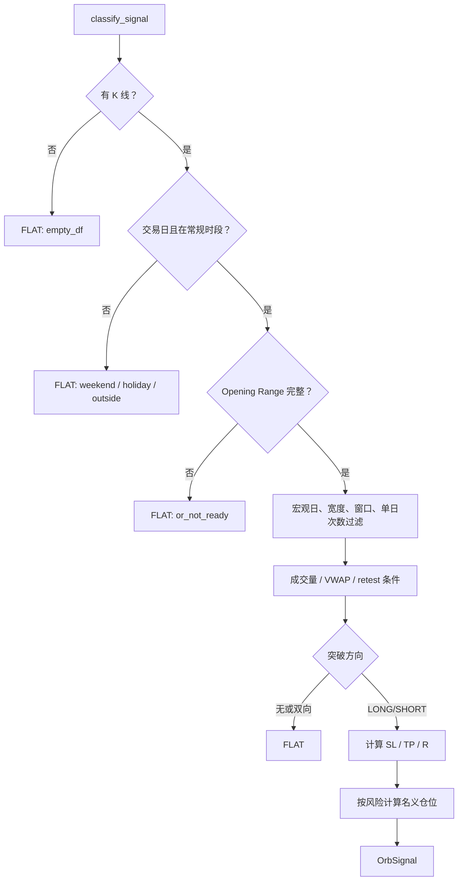

### 6.4 风险定仓

固定名义金额配置优先；否则：

```text
价格风险比例 = abs(entry - stop) / entry
可承受亏损预算 = 机器人权益 × risk_pct × (1 - position_safety_pct)
名义仓位 = 可承受亏损预算 / 价格风险比例
```

例如：

```text
机器人权益 1000 U
risk_pct = 1%
安全折扣 = 15%
入场到止损距离 = 0.5%

亏损预算 = 1000 × 1% × 85% = 8.5 U
名义仓位 = 8.5 / 0.5% = 1700 U
```

## 7. ORB V2 + ML Live Gate

`orb/v2/paper.py::run_scan_conn_v2()` 是当前策略最核心的总编排函数。

### 7.1 完整扫描流程

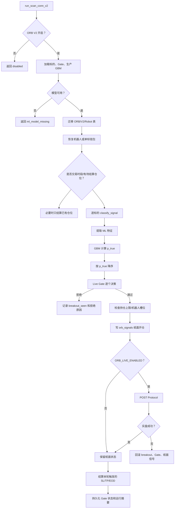

### 7.2 ML 特征和分数

`extract_features()` 从 `OrbSignal.reasons` 和信号字段提取：

- OR 宽度。
- 当前量能与均量比。
- 突破发生在 OR 结束后多少分钟。
- 同方向同步突破标的数量。
- 盘前/市场状态相关特征。
- 方向等数值特征。

模型输出 `p_true`，表示“真突破”的估计概率。

`BreakoutRanker` 优先使用 GBM；只有旧环境才回退 Logistic。当前生产扫描要求 GBM 存在。

标的画像还会对模型概率施加先验修正，使历史质量更高的标的获得适度加权。

### 7.3 Gate 决策顺序

`should_open()` 按以下顺序拒绝：

1. 当日已经触发 day abort。
2. 达到每日开仓上限。
3. 突破过早且同向同步数量处于拥挤陷阱区间。
4. `p_true` 低于阈值；C 级标的阈值更高。
5. 可选 breakout score 不达标。

通过后才增加 `state.opens`。

### 7.4 Gate 状态为什么要持久化

扫描每 5 分钟启动一个新子进程，内存状态会消失。因此：

- `orb_v2_breakout_seen` 保存某标的当日是否真正开过。
- `orb_v2_gate_day` 保存已打分数量、近期概率、day abort。

下一轮扫描从 SQLite 恢复状态，避免重启或子进程切换重置日内限制。

## 8. Robot 资金池

当 `robot_reuse_after_exit=true` 时，系统使用共享 Robot 池。

一个 Robot 可以理解为一个独立的虚拟资金账户：

- 空闲时可以接一笔交易。
- 持仓期间进入 busy 集合。
- 平仓后可以再次被分配。
- 余额来自初始本金加所有结算记录。

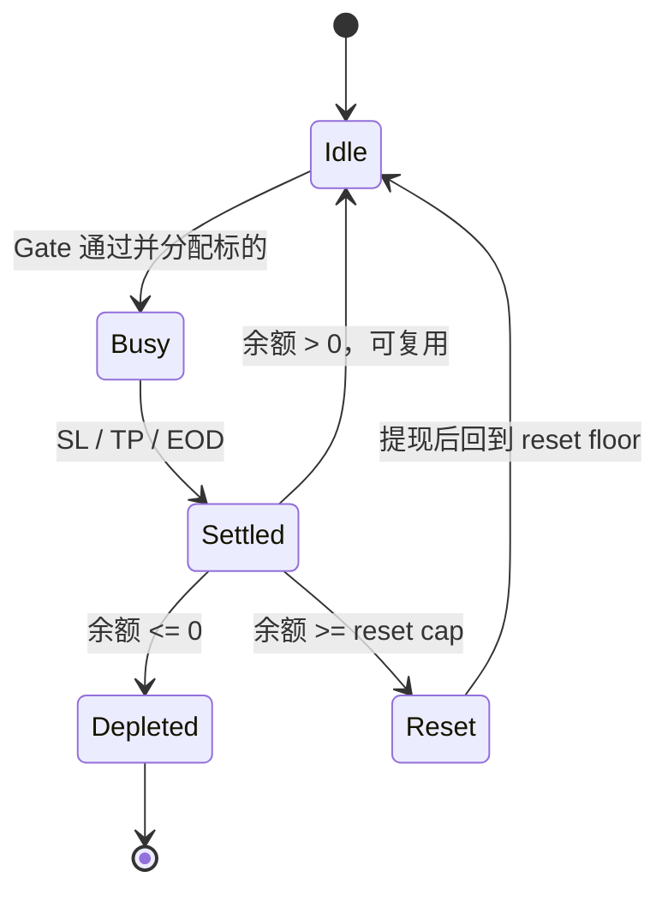

余额计算必须使用 `orb_robots.initial_equity_usdt`，不能使用后来变化的环境变量；
否则修改部署参数后会重算历史机器人的本金。

## 9. 纸面状态与实盘状态一致性

这是项目里最值得学习的事务设计之一。

ORB 先写纸面开仓，因为后续结算、前端展示和 Gate 状态都依赖它。但 HTTP 调用 Protocol
可能失败，因此代码保留以下回滚能力：

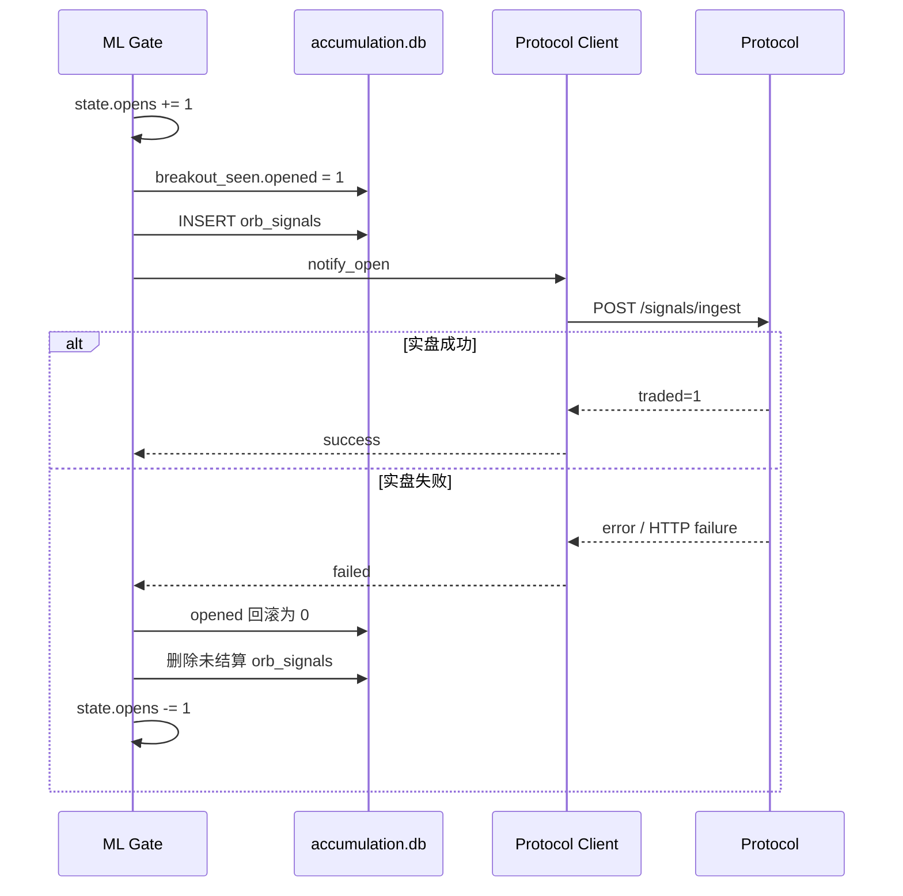

## 10. API 到 Protocol 的信号协议

典型开仓请求：

```json
{
  "source": "orb",
  "api_signal_id": "orb:open:COINUSDT:2026-06-23:...",
  "symbol": "COINUSDT",
  "side": "LONG",
  "action": "open",
  "margin_usdt": 20.5,
  "leverage": 5,
  "entry_price": 101.2,
  "sl_price": 99.8,
  "tp_price": null,
  "play": "ORB"
}
```

其中：

- `api_signal_id` 是跨 HTTP 重试的幂等键。
- `margin_usdt × leverage` 应接近纸面名义金额。
- Protocol 不重新计算 SL、TP 和保证金。
- `PROTOCOL_MAINTENANCE_TOKEN` 通过 `X-Maintenance-Token` 请求头传递。

## 11. Protocol 信号摄入流水线

入口：`POST /api/binance/signals/ingest`。

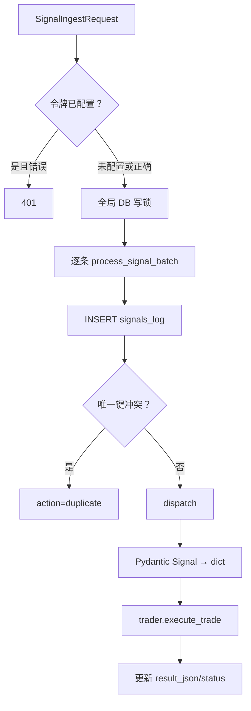

当前守卫链只保留幂等去重。

旧版曾在 Protocol 检查策略开关、来源、持仓上限等；当前这些限制由 API 信号侧负责，
Protocol 作为执行层不应该擅自改变策略意图。

## 12. Protocol 开仓执行

`trader.execute_trade()`：

1. 如果 `action=close`，进入平仓流程。
2. 检查 Binance 鉴权熔断器。
3. 解析保证金和杠杆。
4. 校验基本字段。
5. 查询交易对 step size、tick size、最小名义金额。
6. 设置逐仓和杠杆。
7. 检测单向/双向持仓模式。
8. 获取标记价格。
9. 调用 `open_market()`。

### 12.1 市价开仓流程

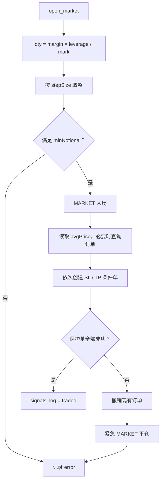

这里的安全原则是：

> 宁可开仓失败，也不能让已开的仓位长期裸奔。

注意：当前 SL 距离校验只记录 warning，不会阻止下单；真正不合法的触发价仍可能被币安拒绝，
随后触发紧急平仓。

## 13. Binance HTTP 客户端

`BinanceClient.request()` 统一负责：

- 添加 `timestamp` 和 `recvWindow`。
- HMAC-SHA256 签名。
- 添加 `X-MBX-APIKEY`。
- 429、418、5xx 指数退避。
- Binance 限流错误码重试。
- `-1021` 时间偏差时同步服务器时间并重签。
- 401/403 上报鉴权失败。

### 13.1 时间同步

```text
offset = Binance serverTime - 本地时间
请求时间戳 = 本地时间 + offset
```

offset 默认每 10 分钟重新同步，收到 `-1021` 时立即同步。

### 13.2 鉴权熔断器

连续 20 次 Binance 401/403 后：

- `_execution_paused = True`
- 新开仓直接拒绝
- 成功的签名请求会清零失败计数并恢复

它防止密钥失效时系统不断向交易所轰炸请求。

## 14. Protocol 平仓与保护单清理

平仓首先读取币安真实持仓，而不是相信本地数据库。

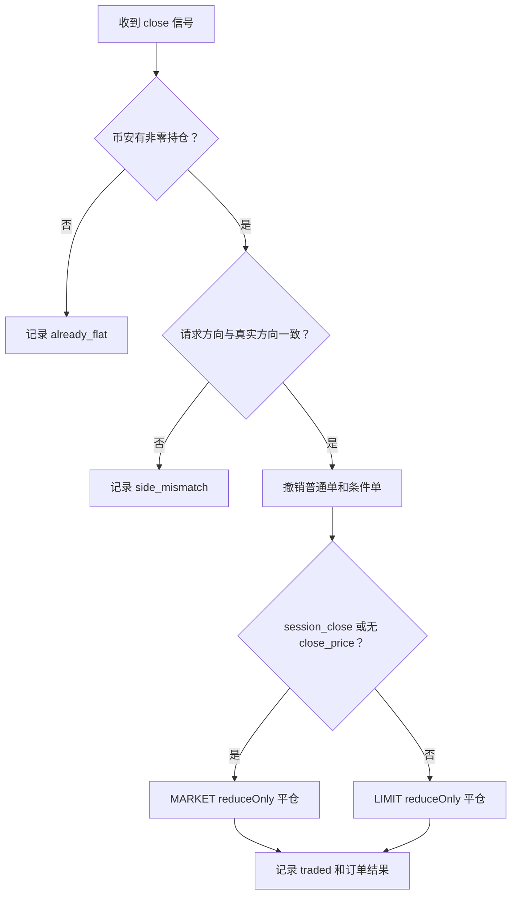

`already_flat` 不是错误。它通常表示交易所的 SL/TP 已经先于策略平仓信号成交。

## 15. 两个数据库

### 15.1 accumulation.db

它不仅是“收筹数据库”，还承载 ORB 纸面状态。

主要表族：

- 收筹池：`watchlist`
- OI 榜单：`heat_accum_watch`、`ambush_watch`、`focus_watch` 等
- 值得关注分类归档：`worth_watch_*`
- S2：`s2_funding_signals`
- ORB：`orb_signals`、`orb_settlements`、`orb_symbol_bots`
- ORB V2：`orb_v2_breakout_seen`、`orb_v2_gate_day`、`orb_v2_runs`
- Robot：`orb_robots`、`orb_robot_resets`

### 15.2 binance.db

当前主要是执行审计库：

- `config`：遗留 KV 表。
- `signals_log`：每个交易动作的请求、状态和结果。

`signals_log` 的唯一键：

```sql
UNIQUE(source, api_signal_id)
```

这是防止 API HTTP 重试导致重复开仓的最后一道防线。

## 16. 前端工作方式

前端没有构建系统和框架，业务 JS 直接内嵌在 HTML。

### 16.1 地址解析

优先级：

1. `localStorage` 人工覆盖。
2. localhost/file 模式使用 `127.0.0.1`。
3. 生产默认地址。

两个后端分别由：

- `api-base.js`
- `binance-api-base.js`

解析。

### 16.2 首页初始化

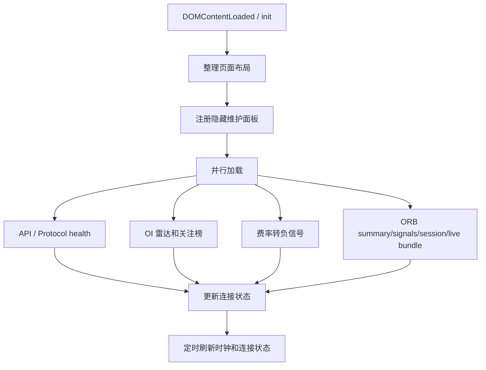

### 16.3 维护令牌

令牌仅保存在当前标签页 `sessionStorage`：

- `NEXT_K_MAINTENANCE_TOKEN`
- `PROTOCOL_MAINTENANCE_TOKEN`

普通浏览数据不需要令牌；清库、手工触发任务、导出卷、签署 TradFi 等敏感操作会带请求头。

## 17. 失败处理总表

| 场景 | 处理方式 |
|---|---|
| 扫描任务重叠 | 非阻塞锁，后触发的一轮跳过 |
| 手动 OI 刷新过频 | 冷却时间，HTTP 429 |
| 同一个交易信号重复发送 | SQLite 唯一键，返回 duplicate |
| Protocol 未配置令牌 | 兼容开放模式并打印警告 |
| 配置令牌但请求错误 | HTTP 401 |
| Binance 429/5xx | 指数退避重试 |
| Binance 时间戳错误 | 同步服务器时间后重签 |
| Binance 连续鉴权失败 | 20 次后暂停新开仓 |
| 开仓成功但保护单失败 | 撤单并紧急市价平仓 |
| 策略平仓时仓位已被 SL/TP 平掉 | 记录 already_flat，视作成功 |
| API 纸面开仓成功但 Protocol 实盘失败 | 回滚纸面仓位和 Gate 计数 |
| 生产 GBM 缺失 | ORB V2 本轮失败，不以默认概率贸然开仓 |

## 18. 推荐阅读顺序

### 第一阶段：看懂系统骨架

1. `next-k-api/main.py`
2. `next-k-api/scheduler_config.py`
3. `next-k-api/worker_tasks.py`
4. `Next-k-protocol/main.py`
5. `Next-k-protocol/router.py`
6. `next-k-frontend/api-base.js`

### 第二阶段：看懂一笔 ORB 信号

1. `orb/core/session.py`
2. `orb/core/breakout.py`
3. `orb/core/signals.py`
4. `orb/v2/paper.py`
5. `orb/ml/features.py`
6. `orb/ml/gate.py`
7. `orb/core/live_exec.py`

### 第三阶段：看懂真实下单

1. `ingest/pipeline.py`
2. `ingest/guards.py`
3. `ingest/dispatcher.py`
4. `trader.py::execute_trade`
5. `trading/market_entry.py`
6. `trading/protective.py`
7. `binance/client.py`

### 第四阶段：看懂持久化与恢复

1. `accumulation_radar.py::init_db`
2. `orb/core/db.py`
3. `orb/v2/db.py`
4. `orb/v2/gate_state.py`
5. `orb/v2/robots.py`
6. `repos/connection.py`
7. `repos/signals_repo.py`

## 19. 调试一笔交易的方法

按 `api_signal_id` 从上到下追踪：

1. API 日志中搜索标的和 `orb:open:*`。
2. 查 `accumulation.db.orb_signals` 是否写入。
3. 查 `orb_v2_breakout_seen.opened`。
4. 查 Protocol `signals_log` 是否收到相同 `api_signal_id`。
5. 查看 `payload_json` 确认 margin、leverage、SL、TP。
6. 查看 `result_json` 中 entry/sl/tp order ID。
7. 调 `/api/binance/positions` 对照币安真实持仓。
8. 如果纸面有、实盘无，检查 API 是否执行了 live rollback。

## 20. 当前代码中的历史兼容层

阅读时不要被名字误导：

- 顶层旧文档仍可能提到 ZCT/Momentum/Jiezhen，但当前信号主线是 ORB。
- `config` 表仍保留，但交易参数已主要由 API 每条信号携带。
- `limit_entry.py` 仍存在，但 `execute_trade()` 当前固定走 MARKET。
- `heat_zones`、`heat_bpc` 维护任务名只是兼容别名。
- `run_orb_v2_scan_task()` 是旧维护接口名称的兼容包装。

## 21. 修改代码时必须守住的边界

1. 不要让 Protocol 重新计算策略仓位，否则纸面与实盘会产生两个真相。
2. 不要删除 `api_signal_id` 唯一约束。
3. 不要在保护单失败后只记录日志而不平仓。
4. 不要在多 worker 中重复启动内嵌调度器。
5. 不要把生产模型依赖改为 `output/` 中的临时实验文件。
6. 不要把真实 Binance 密钥或维护令牌提交到 Git。
7. 修改 Robot 本金逻辑时必须考虑历史机器人已建档的本金。
8. 修改 Gate 时必须同时考虑跨扫描持久化状态和回滚。
